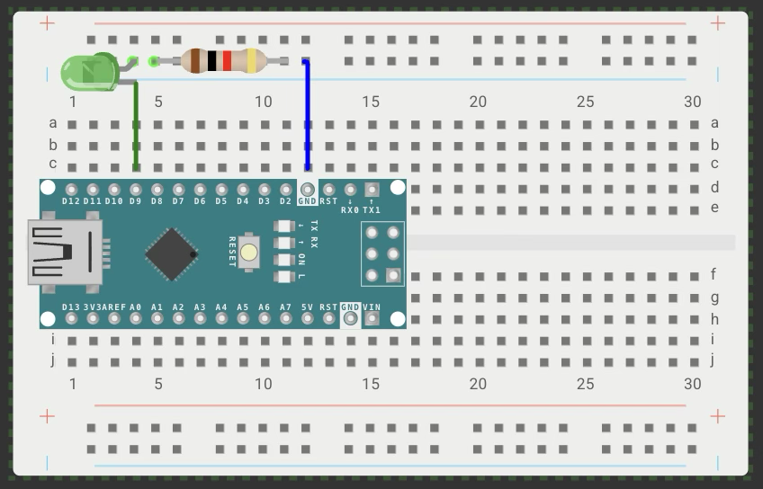
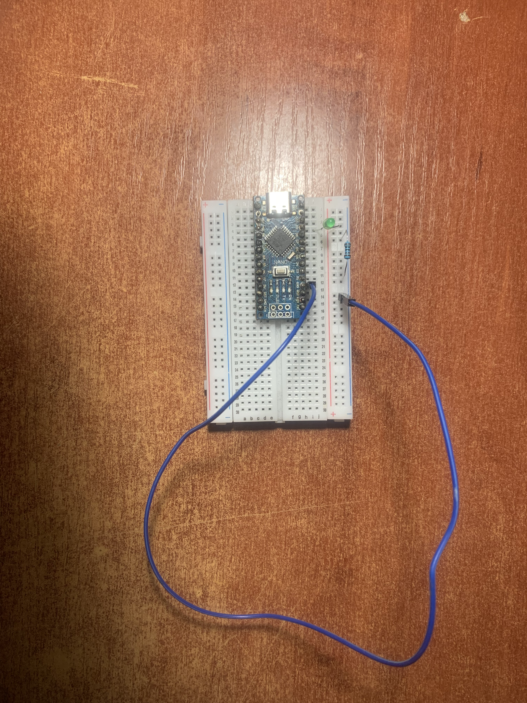

# Project 01: Blinking LED

## Description
Simple blinking LED on Arduino Nano (pin 9). First embedded project.

## Components
- Arduino Nano
- LED (red)
- Resistor ~970 Ω (temporary)
- Breadboard, wires

## Wiring
- Pin D9 → LED anode (long leg)
- LED cathode → resistor ~970 Ω
- Resistor other end → GND

## Code
See [01_blink.ino](01_blink.ino)

## Photo

## Resistor calculation (to be added)

## Demo video
[YouTube Shorts] https://youtube.com/shorts/OBoBesEFEso?si=NwwLcpWLqa_WGW5E

## What I learned
- pinmode(), digitalWrite(), delay()
- LED polarity
- Resistor importance (current limiting)