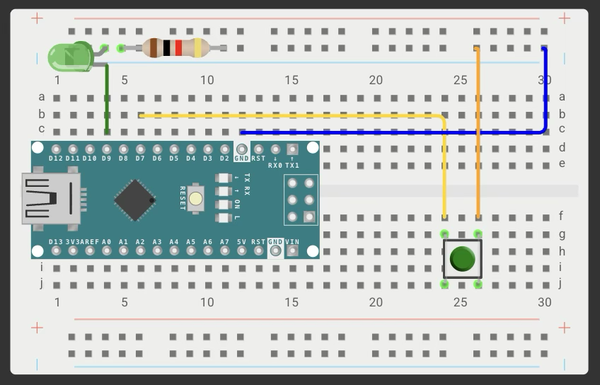
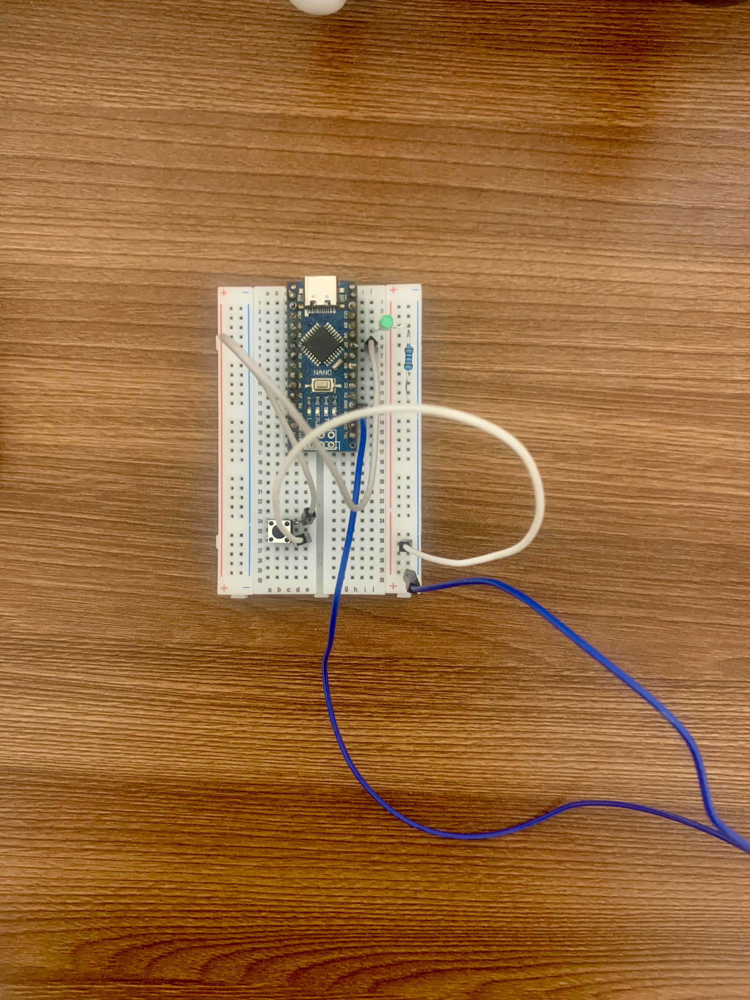

# Project 02: Button-Controlled LED

## Description
Press a button to turn an LED on; release to turn it off.  
Learning objectives: digital input, pull-up resistor, basic debouncing.

## Components
- Arduino Nano 
- LED (any color)
- Resistor for LED: ~220 Ω (calculated)
- Push button (tactile switch)
- Resistor for button: internal pull-up (INPUT_PULLUP) — no external needed
- Breadboard, jumper wires

## Wiring
- LED: Pin D9  → LED anode resistor → LED cathode → resistor → GND.
- Button: Pin D7 → button one leg; other leg → GND. (Internal pull-up enabled in code.)

## Code
See [02_button.ino](02_button.ino)

## Photo

## Demo video
[YouTube Shorts](https://youtube.com/shorts/CQIm1Eb39MU)

## Resistor calculation (for LED)
- LED forward voltage: 2.0 V
- LED current: 20 mA
- Supply: 5 V
- R = (5 - 2) / 0.02 = 150 Ω → nearest standard 220 Ω.

## What I learned
- Using `pinMode(buttonPin, INPUT_PULLUP)` to enable internal pull-up.
- Reading digital input with `digitalRead()`.
- Button logic: when pressed, pin reads LOW (because pull-up connects to HIGH normally, button shorts to GND).
- Simple debouncing (delay(50) approach).

## Related projects
- [01_blink](../01_blink/) – basic LED blinking.