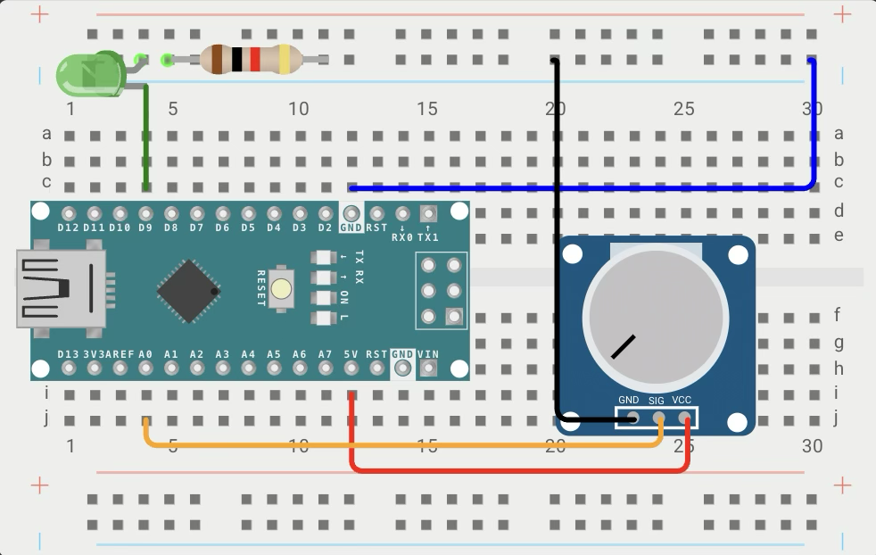
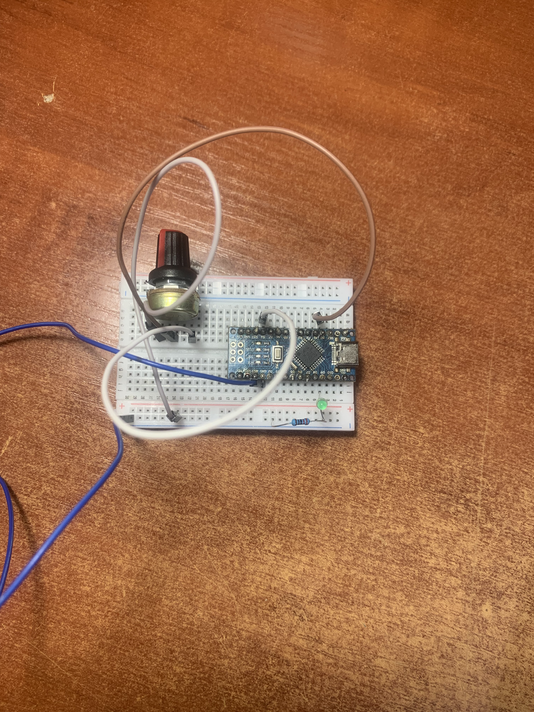

# Project 03: Potentiometer‑controlled LED Brightness

## Description
This project demonstrates how to read an analog voltage from a potentiometer and use it to control the brightness of an LED via Pulse Width Modulation (PWM). The LED smoothly changes its intensity as you rotate the potentiometer knob.

## Components
- Arduino Nano (compatible with Uno)
- LED (any color)
- Resistor 220 Ω (current limiting for the LED)
- Potentiometer 10 kΩ (linear taper)
- Breadboard and jumper wires

## Wiring

| Component               | Connection                           |
|-------------------------|--------------------------------------|
| **LED**                 | D9 (PWM pin) → anode (long leg)      |
|                         | Cathode (short leg) → 220 Ω resistor → GND |
| **Potentiometer**       | SIG → A0 (analog input)       |
|                         | GND → GND       |
|                         | VCC → 5V      |

> **Note:** The LED must be connected to a **PWM‑capable pin** (on Nano/Uno: 3, 5, 6, 9, 10, 11). Pin 9 is used here.

## Code

The complete sketch is available in the repository: [03_potentiometer.ino](03_potentiometer.ino)

## How It Works

1. The potentiometer acts as a **voltage divider**. Rotating the knob changes the voltage on the middle pin between 0 V and 5 V.
2. `analogRead(A0)` converts that voltage into a 10‑bit number (0–1023) using the microcontroller’s **ADC** (Analog‑to‑Digital Converter).
3. `map()` re‑scales the value from the 0–1023 range into the 0–255 range expected by `analogWrite()`.
4. `analogWrite(LED, brightness)` generates a **PWM signal** on pin 9. The average voltage seen by the LED increases with higher duty cycle, making the LED brighter.
5. The loop runs continuously, so the brightness updates instantly when you turn the potentiometer.

## Media

**Wokwi schematic:**

**Real breadboard photo:**

**Demo video (YouTube Shorts):**

[LED brightness control video](https://youtube.com/shorts/pFf8Kw6z3Gk)

## What I Learned

- **Analog input** with `analogRead()` and the 10‑bit ADC resolution.
- **Voltage divider** principle applied to a potentiometer.
- Using `map()` to convert numeric ranges.
- **PWM (Pulse Width Modulation)** and the `analogWrite()` function.
- Which pins on Arduino Nano/Uno support PWM (3, 5, 6, 9, 10, 11).

---
