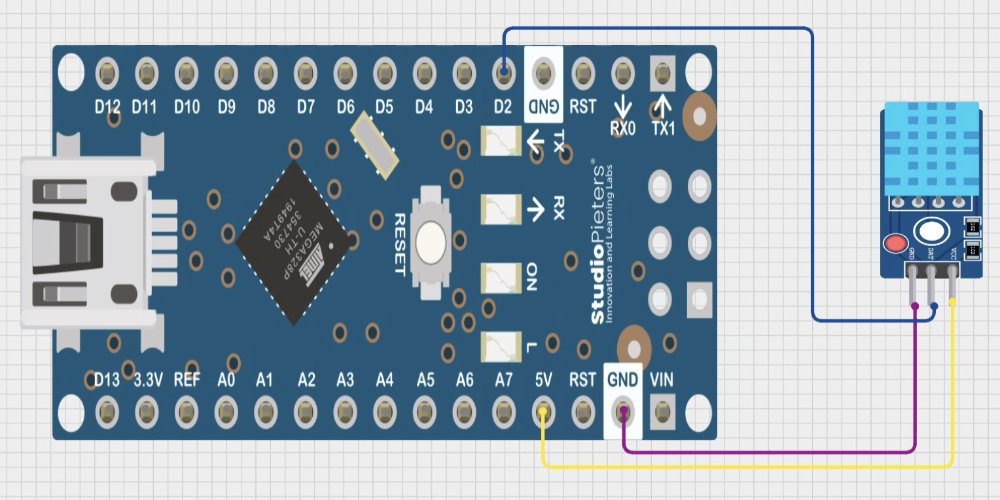
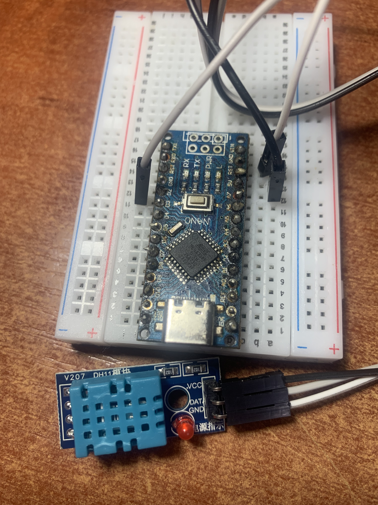

# Project 04: DHT11 Temperature and Humidity Sensor (Module)

## Description
This project reads temperature and humidity data from a DHT11 sensor module and outputs the values to the Serial Monitor. A non‑blocking timer (`millis()`) ensures the sensor is polled every 2 seconds as required by the datasheet.

## Components
- Arduino Nano (or Uno)
- DHT11 sensor **module** (with built‑in pull‑up resistor) – no external resistor needed
- Breadboard and jumper wires (3 wires: VCC, DATA, GND)

## Wiring

| DHT11 Module Pin | Arduino Pin |
|-----------------|-------------|
| VCC             | 5V          |
| DATA            | Digital pin 2 |
| GND             | GND         |

> **Note:** The module already contains the required 10 kΩ pull‑up resistor between VCC and DATA. Therefore no external resistor is shown in the schematic.

## Code

The full sketch is available in the repository: [04_dht11_sensor.ino](04_dht11_sensor.ino)

## How It Works

1. The DHT11 module communicates over a single‑wire protocol.
2. The `DHT` library handles all low‑level timing and CRC checking.
3. `dht.read()` performs one complete sensor reading and stores the raw data internally.
4. `dht.readTemperature()` and `dht.readHumidity()` return the converted values from that same reading.
5. A non‑blocking timer (`millis()`) ensures the sensor is polled exactly every 2 seconds – the minimum interval recommended by the datasheet.
6. If the reading fails (e.g., disconnected sensor), `dht.read()` returns `false` and an error message is printed.

## Media

**Schematic (Cirkit Designer):**

**Real breadboard photo:**

**Demo video:**

[11-05-2026_04_DHT11_sensor_demo](https://youtube.com/shorts/3mBmLnJkDYc)

## What I Learned

- Using a digital sensor with a dedicated library.
- Reading two physical quantities (temperature and humidity) from one device.
- Non‑blocking timing with `millis()` instead of `delay()`.
- The importance of the pull‑up resistor and why modules often include it.
- Error handling when a sensor read fails.

## Next Steps

- Add an LCD display to show readings without a PC.
- Log data to an SD card.
- Send data via Bluetooth or WiFi.
- Trigger an LED or buzzer when temperature exceeds a threshold.
