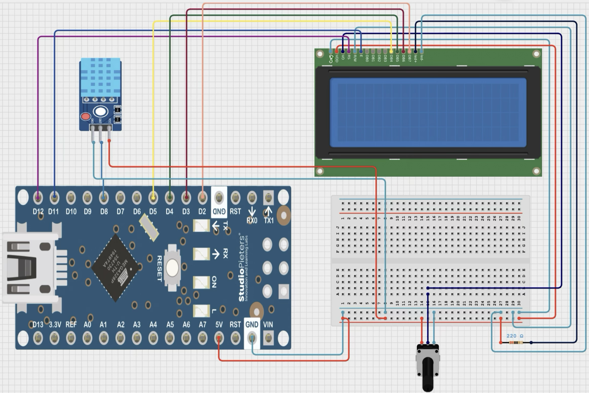
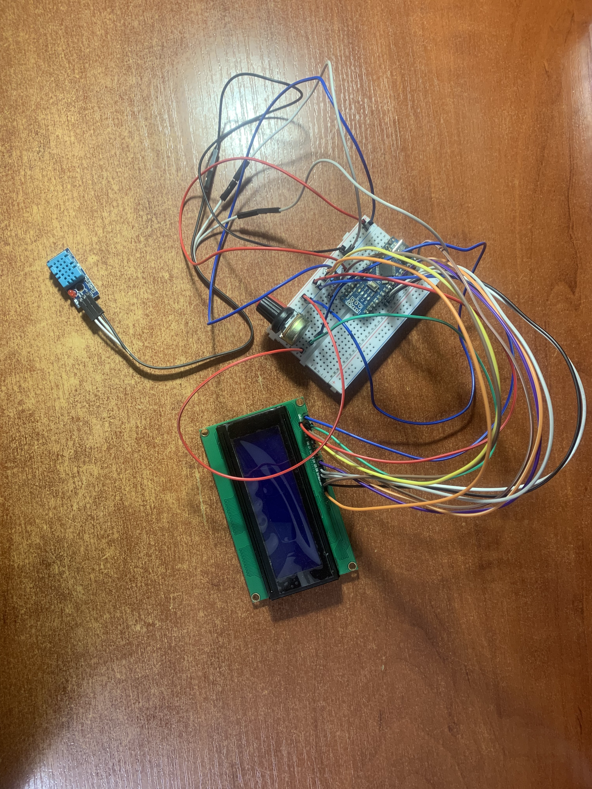

# Project 05: Weather Station with DHT11 and LCD2004 (Parallel)

## Description
This project combines a DHT11 temperature and humidity sensor with a parallel LCD2004 display (20×4 characters) to create a simple weather station. Data is updated every 2 seconds using a non‑blocking timer (`millis()`). The LCD shows a fixed header on the first row, temperature on the second row, and humidity on the third row.

## Components
- Arduino Nano (or Uno)
- DHT11 sensor (module with built‑in pull‑up resistor)
- LCD2004 display (20×4, parallel interface, **without I2C**)
- Potentiometer 10 kΩ (for contrast adjustment)
- Resistor 220 Ω (for backlight current limiting)
- Breadboard and jumper wires

## Wiring

### LCD2004 to Arduino Nano (4‑bit mode)

| LCD Pin | Name   | Arduino Pin | Notes                     |
|---------|--------|-------------|---------------------------|
| 1       | GND    | GND         | Ground                    |
| 2       | VDD    | 5V          | Power                     |
| 3       | V0     | Middle of 10 kΩ pot      | Contrast adjustment       |
| 4       | RS     | 12          | Register select           |
| 5       | RW     | GND         | Write mode only           |
| 6       | E      | 11          | Enable strobe             |
| 11      | D4     | 5           | Data bus bit 4            |
| 12      | D5     | 4           | Data bus bit 5            |
| 13      | D6     | 3           | Data bus bit 6            |
| 14      | D7     | 2           | Data bus bit 7            |
| 15      | A (LED+) | 5V via 220 Ω resistor | Backlight anode |
| 16      | K (LED‑) | GND        | Backlight cathode         |

**Potentiometer:** outer legs → 5V and GND; middle leg → LCD pin 3 (V0).

### DHT11 to Arduino Nano

| DHT11 Pin | Arduino Pin |
|-----------|-------------|
| VCC       | 5V          |
| DATA      | 8           |
| GND       | GND         |

> The DHT11 module already includes a 10 kΩ pull‑up resistor between VCC and DATA.

## Code

The full sketch is available in the repository: [05_lcd_dht11.ino](05_lcd_dht11.ino)

```cpp
#include <DHT.h>
#include <LiquidCrystal.h>

#define DHTPIN 8
#define DHTTYPE DHT11
DHT dht(DHTPIN, DHTTYPE);

const byte rs = 12, en = 11, d4 = 5, d5 = 4, d6 = 3, d7 = 2;
LiquidCrystal lcd(rs, en, d4, d5, d6, d7);

unsigned long previous_time = 0;
const unsigned long interval = 2000;

void setup() {
  dht.begin();

  lcd.begin(20, 4);
  lcd.setCursor(0, 0);
  lcd.print("Temp & Humidity");
}

void loop() {
  unsigned long current_time = millis();
  if (current_time - previous_time >= interval) {
    previous_time = current_time;

    float T = dht.readTemperature();
    float H = dht.readHumidity();

    if (isnan(T) || isnan(H)) {
      lcd.clear();
      lcd.setCursor(0, 0);
      lcd.print("ERROR");
    } else {
      lcd.setCursor(0, 0);
      lcd.print("Temp & Humidity");

      lcd.setCursor(0, 1);
      lcd.print("Temp: ");
      lcd.print(T, 1);
      lcd.print(" ");
      lcd.print((char)223);
      lcd.print("C");

      lcd.setCursor(0, 2);
      lcd.print("Hum: ");
      lcd.print(H, 1);
      lcd.print(" %");
    }
  }
}
```
## How It Works

1. **DHT11** sends temperature and humidity readings every 2 seconds (datasheet minimum interval).
2. **`millis()`** ensures non‑blocking timing – the rest of the code is never frozen.
3. **LCD2004** is operated in **4‑bit parallel mode** (uses only 4 data lines instead of 8, saving I/O pins).
4. The first row shows a fixed header; rows 2 and 3 show current temperature and humidity.
5. If a sensor reading fails (e.g., disconnected wire), the LCD shows `"ERROR"` and the header is rewritten once communication recovers.

## Media

**Schematic (circuit simulator):**



**Real breadboard photo:**



**Demo video (YouTube Shorts):**

[Weather station video](https://youtube.com/shorts/64V0xcmnG_Y)


## What I Learned

- Using a parallel LCD without an I2C backpack – understanding the 4‑bit mode and control pins (RS, E, D4‑D7).
- Adjusting contrast with a potentiometer (voltage divider).
- Limiting current for the backlight with a resistor.
- Combining two libraries (`DHT.h` and `LiquidCrystal.h`) in one sketch.
- Restoring the display header after an error condition.
- Printing custom characters (degree symbol via `(char)223`).

## Next Steps

- Build an obstacle‑avoiding robot using an ultrasonic sensor (HC‑SR04), a motor driver (L298N or L9110S), and two DC motors. The robot will turn away from obstacles and continue moving.

- Add a servo to sweep the ultrasonic sensor for better obstacle detection.

- Replace the parallel LCD with an I2C version to save pins and simplify wiring for the robot.

- Integrate the DHT11 and LCD into a future robot to display temperature/humidity on the go.
---

**All code, schematics, and videos are part of my embedded learning portfolio.**  
[Back to main repository](https://github.com/KirillM314/embedded-learning-journal/blob/main/README.md)
