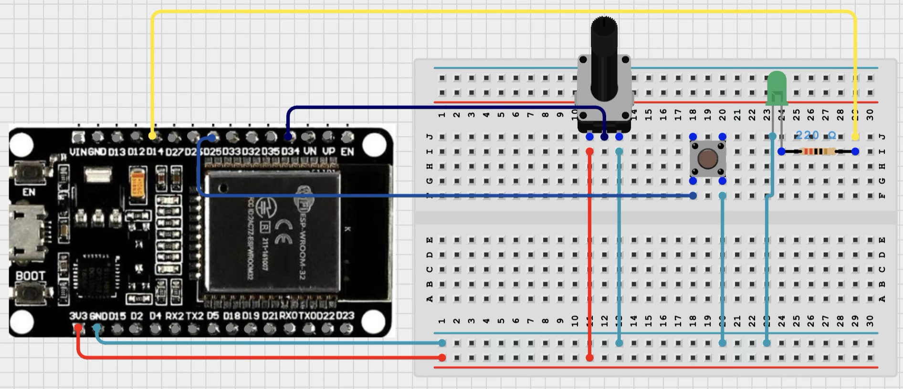
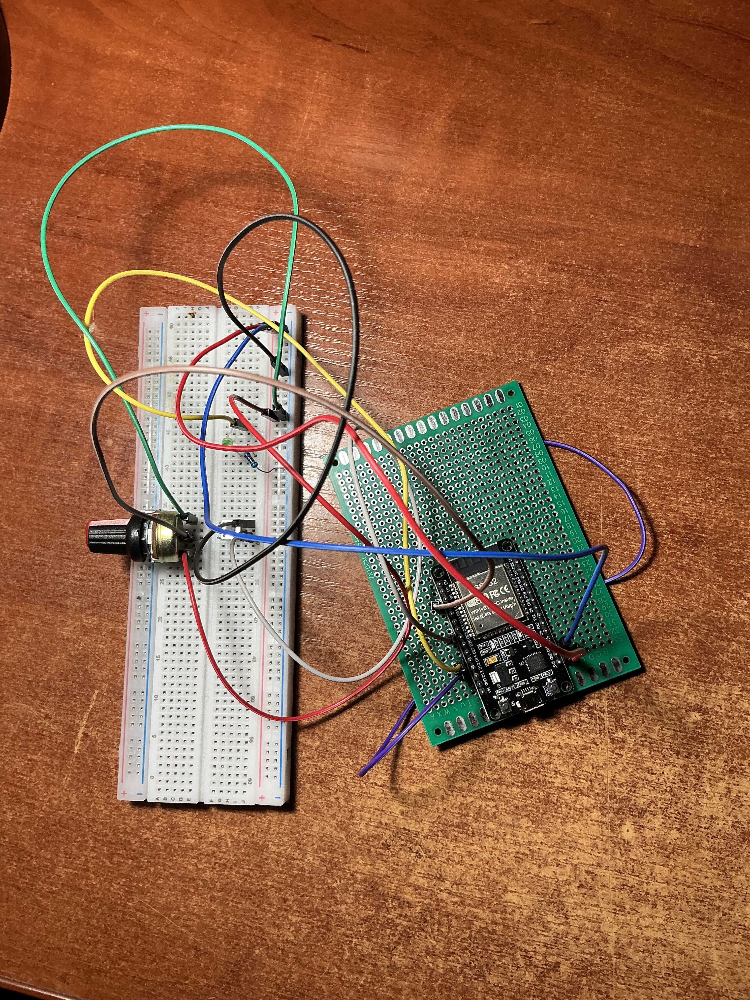

# Project 08: Refactoring Hardware Control into Object-Oriented Programming (OOP)

## Overview
Following the successful deployment of Project 07, this project focuses on upgrading the software architecture from standard **Procedural Programming** to **Object-Oriented Programming (OOP)** in C++. 

The goal was to abstract the hardware layers (buttons, LEDs, and potentiometers) into independent, reusable C++ classes. This modular approach eliminates global variable clutter, implements data encapsulation, and prepares a scalable architecture for future multi-component embedded systems (like autonomous robotics).

The full sketch is available in the repository: [`08_esp32_oop_basics.ino`](08_esp32_oop_basics.ino)

---

## Core Engineering Concepts Learned

### 1. Object-Oriented Abstraction & Encapsulation
* **Data Hiding (`private`):** Internal states like timing registers (`_previousTime`), tracking flags, and hardware pin definitions are locked inside the classes. The main program cannot accidentally modify them.
* **Public Interface (`public`):** The main `loop()` interacts with the hardware through safe, standardized endpoints like `.init()`, `.tick()`, and `.update()`.

### 2. Event-Driven Loop Execution
Instead of wastefully executing print statements on every CPU cycle, the upgraded `FilteredPot` class implements an **Event-Driven design**. The `.update()` method yields a boolean signal (`true`) *only* when the timing criteria is matched and a fresh mathematical data point is generated. This frees up precious microcontroller clock cycles.

### 3. Scalability (The LEGO Brick Approach)
By moving logic out of global functions and into instances, duplicate hardware elements can be declared instantly without rewriting any structural code. Adding multiple buttons or secondary filtering sensors requires just one line of object declarations.

---

## Architecture Breakdown

| Class | Key Private Fields | Key Public Methods | Responsibility |
|--- |--- |--- |--- |
| **`DebouncedButton`** | `_butFlag`, `_ledFlag`, `_previousTimeLED` | `init()`, `tick()` | Manages hardware debounce timing and processes single-press edge transitions to toggle states. |
| **`FilteredPot`** | `_filteredPotValue`, `_k`, `_potInterval` | `init()`, `update()`, `getValue()` | Controls precise sample-rate reads and processes data using a First-Order Low-Pass Filter. |

---

## Media & Hardware Demonstration

The physical circuit remains identical to Project 07, emphasizing that refactoring was entirely focused on structural software engineering.

### 1. Circuit Schematic (Simulator)

### 2. Physical Hardware Assembly

### 3. Video Demonstration

---

## How to Run
1. Navigate to your local folder and open the project directory: `01_basics/08_esp32_oop_basics`.
2. Open the file in your VS Code environment or Arduino IDE.
3. Verify your ESP32 board connection via your data cable.
4. Compile and upload the sketch.
5. Set your Serial Monitor to `115200 baud` and observe the exact same high-precision output as Project 07, now running on a highly professional OOP foundation.